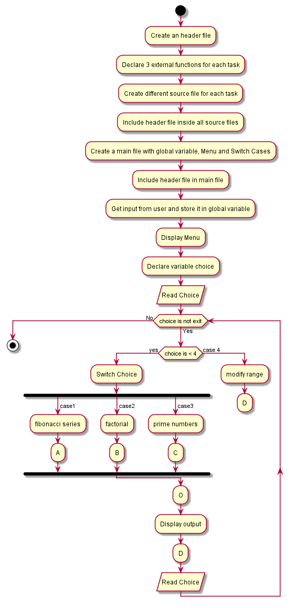

# Fib-Fact-Prime
- Objective:

To create a menu which performs tasks such as printing Fibonacci series and prime numbers in a user entered number range.
Also to find the factorial of a given number using recursive function.

The repository consists of following directories:

- Assets:

    Assets are flowchart files. We created our flowchart for the task using Plantuml and stored it here.

- Docs:

    It contains various issues we faced while developing Source for the given task. It is useful for future purpose while debugging an same kind of issue.

- Src:

    It contains our task's source. We can pull this source and work with it on any required time.

The following are Flowcharts for the task:

- General Flowchart:

- Flowchart for Fibonacci Series:

- Flowchart for Factorial of a Number:

- Flowchart for Prime Numbers:

- Flowchart to Modify Input:

    

- Version:

    fib-fact-prime Version_v1.0.0